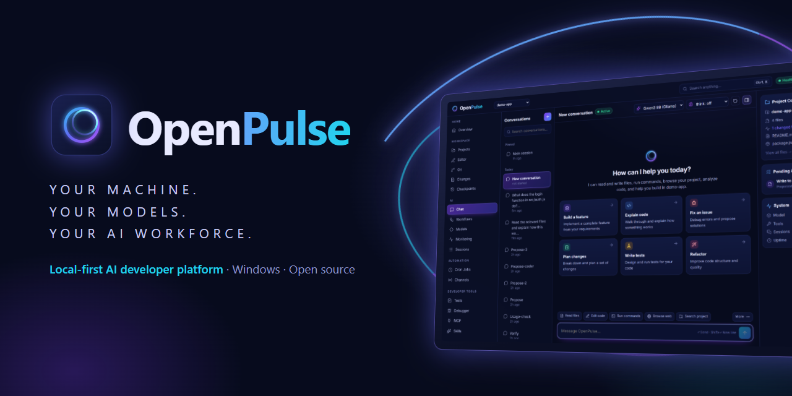

<p align="center">
  
</p>

<h1 align="center">OpenPulse</h1>

<p align="center">
  <b>Your machine. Your models. Your AI workforce.</b><br />
  A local-first AI developer platform: a Windows desktop app and gateway that run coding agents on
  your own PC, with your own models, under rules you set.
</p>

<p align="center">
  <a href="https://github.com/steventa2024-lgtm/openpulse/releases">Releases</a> ·
  <a href="#quick-start">Quick start</a> ·
  <a href="packages/sdk">SDK</a> ·
  <a href="IMPLEMENTATION.md">Progress</a>
</p>

<p align="center">
  
</p>

OpenPulse runs agents on your machine with real access to your projects, shell and browser — inside
permissions the gateway enforces. Use local models through Ollama or LM Studio (no API key needed) or a
hosted provider you choose. Agents read your code, run your tests and **propose** changes as diffs; you
review them file by file, and a checkpoint is taken before anything is applied. Reach it from the
desktop app, a browser, the terminal, the SDK or Telegram. State is plain files under `~/.openpulse` —
no account, no database, no OpenPulse cloud.

> OpenPulse is a clean-room implementation written from public documentation of the OpenClaw project.
> It shares that architecture — a gateway daemon, a Markdown workspace, skills, cron and heartbeats —
> but none of its code.

## The platform

- **Desktop app (Windows).** Starts and supervises the gateway, attaches to one already running,
  recovers from crashes, and keeps your data in `~/.openpulse` across installs and upgrades.
- **Local models.** Detects Ollama and LM Studio, tests a model with a real prompt, and sets a default
  plus ordered fallbacks. Ollama gets a 16k context window by default (configurable).
- **Workspace.** Projects, Git, a Monaco editor, diff review with per-file approval, and checkpoints that
  keep uncommitted work.
- **Automation.** Multi-agent workflows (planner, coder, tester, reviewer), MCP servers, skills, cron.
- **Developer tools.** Test runner with agent-proposed fixes, a run debugger, measured-only monitoring,
  and a typed TypeScript SDK.
- **Permissions.** Read-only, balanced or custom modes, folder boundaries, a secret deny list and shell
  approvals — enforced in the tools themselves.

## What it does

- **Lives in your chats.** Telegram DMs and groups today, with a channel plugin interface for more.
  New people get a pairing code you approve; group messages need a mention.
- **Runs real work.** Shell, file read/write/edit, background processes, web fetch and search, a
  headless browser, cron, and messaging tools — all on your host.
- **Asks before anything risky.** Commands are risk-classified against an allowlist; anything unknown
  stops and waits for an approval from chat, the dashboard or the CLI. Catastrophic commands are refused.
- **Has a memory and a routine.** A Markdown workspace it reads on every turn, a daily memory file, a
  heartbeat that checks `HEARTBEAT.md` on a schedule, and cron jobs that wake it with a prompt.
- **Is one process.** The gateway owns the agent, the channels, the scheduler and the Control UI, and
  speaks one WebSocket protocol to every client.

## Quick start

```bash
pnpm install
pnpm build
pnpm cli -- onboard
```

The wizard writes `~/.openpulse/openpulse.json`, creates the workspace and generates a gateway token.
Then:

```bash
pnpm cli -- gateway
```

Open <http://127.0.0.1:18789> for the Control UI, or stay in the terminal with `pnpm cli -- tui`.

## Repository layout

| Package              | What lives there                                                           |
| -------------------- | -------------------------------------------------------------------------- |
| `packages/gateway`   | The daemon: agent loop, tools, channels, cron, heartbeat, WebSocket server |
| `packages/cli`       | `openpulse` — onboarding, daemon control, chat, and every gateway RPC      |
| `packages/dashboard` | The Control UI (React + Vite), served by the gateway from the same port    |
| `packages/sdk`       | `@openpulse/sdk` — the typed TypeScript/JavaScript client (not on npm yet) |
| `apps/desktop`       | The Windows desktop app (Electron) and its installer configuration         |
| `apps/web`           | The public website: static pages, docs, and a download page fed by GitHub  |
| `assets/brand`       | The halo logo and app icon sources, and the README banner                  |

## The gateway

One HTTP server on port **18789** serves the Control UI, channel webhooks, `/health`, and the
WebSocket control plane. Every client — browser, CLI, remote node — completes the same handshake:

1. the server sends `connect.challenge` with a nonce;
2. the client answers `connect`, signing the nonce with its ECDSA P-256 device key and presenting the
   gateway token;
3. the server replies `hello-ok` with the method list, event list and a state snapshot.

Devices on loopback are paired automatically; anything else waits for `openpulse devices approve`.
After that it is `req`/`res` frames in both directions plus server `event` frames (`chat`, `agent`,
`heartbeat`, `cron`, `exec.approval.requested`, `presence`, …).

## Workspace

`~/.openpulse/workspace` is the agent's home, and every file in it is injected into the prompt as
Project Context:

| File           | Purpose                                              |
| -------------- | ---------------------------------------------------- |
| `AGENTS.md`    | House rules — how to behave, what to avoid           |
| `SOUL.md`      | Personality and voice                                |
| `IDENTITY.md`  | Who the agent is                                     |
| `USER.md`      | Who you are                                          |
| `TOOLS.md`     | Local notes about tools and hosts                    |
| `HEARTBEAT.md` | The standing checklist read on each heartbeat        |
| `BOOTSTRAP.md` | First-run checklist the agent works through          |
| `MEMORY.md`    | Long-term notes, plus `memory/YYYY-MM-DD.md` per day |

Skills are folders with a `SKILL.md` — a name, a description and instructions. They are listed to the
agent as available skills and read on demand, and a skill can declare requirements (binaries, env
vars, config keys, OS) that decide whether it is offered at all. Workspace skills override managed
ones (`~/.openpulse/skills`), which override the bundled set.

## Sessions

Every conversation is its own session with its own transcript:

```
agent:main:main                      the main session (heartbeats, cron notes, the dashboard)
agent:main:telegram:dm:<userId>      one per person
agent:main:telegram:group:<chatId>   one per group, optionally per topic
agent:main:cron:<jobId>              one per isolated cron job
```

Sessions are indexed in `agents/main/sessions/sessions.json`; each transcript is JSONL, one message
per line, so you can read or grep it with ordinary tools.

## Configuration

`~/.openpulse/openpulse.json` is JSON5 (comments and trailing commas welcome), strictly validated —
unknown keys are rejected — and `${ENV_VAR}` is substituted from the environment. The gateway watches
the file and hot-reloads everything except the port and bind address. Edit it by hand, from the Config
page, or with the CLI:

```bash
openpulse config get agents.defaults.model.primary
openpulse config set agents.defaults.heartbeat.every '"30m"'
```

Models are addressed as `provider/model` and routed through the Vercel AI SDK: `anthropic/…`,
`openai/…`, `ollama/…`, `lmstudio/…`. Local models need a large context window — at least 32k.

## CLI

```
openpulse onboard                   first-run wizard
openpulse setup                     config + workspace, no prompts
openpulse gateway                   run the daemon (also: gateway status, gateway call)
openpulse tui                       interactive chat, with inline approvals
openpulse agent -m "…"              one turn, printed
openpulse status | health | doctor  what is going on
openpulse logs --follow             stream the log
openpulse sessions | channels | pairing | devices | cron | skills | approvals | config
openpulse message send telegram 42 "on my way"
openpulse system heartbeat last | run | enable | disable
```

Every command takes `--json` for scripting, `--url`/`--token` for a remote gateway, and `--profile`
for a second state directory.

## Control UI

Served from the gateway on the same port: **Chat** with streaming replies, tool cards and approval
prompts; **Control** for overview, channels, instances, sessions and cron; **Agent** for skills and
nodes; **Settings** for config, debug and logs. The browser gets its own device key (WebCrypto,
stored in `localStorage`) and pairs like any other client.

## Safety

The agent runs commands as you. Three things keep that honest:

- **Risk classification.** Every shell command is assessed; catastrophic ones are refused outright.
- **Approvals.** `exec-approvals.json` sets the policy — `deny`, `allowlist` or `full`, and whether to
  ask on a miss or always. Pending requests appear in chat, in the dashboard and in `openpulse approvals`.
- **Pairing.** Nobody can talk to the agent until you approve their code, and no browser or CLI beyond
  loopback can control the gateway until you approve its device.

## Development

```bash
pnpm dev            # gateway (tsx watch) + dashboard (vite)
pnpm check          # format:check, lint, typecheck, test
pnpm build          # build all packages
```

Tests are Vitest: the gateway suite runs a real gateway with a scripted model, the CLI suite drives
the command tree against it, the dashboard covers its helpers, the website checks every built page, and
the desktop suite covers gateway supervision and the release scripts.

Every push and pull request runs the same checks on GitHub Actions (Windows), plus an unpacked
desktop build whose contents are verified.

## Releasing

```bash
node apps/desktop/scripts/release/prepare.mjs set-version 0.2.0
git commit -am "Release 0.2.0"
git tag v0.2.0
git push origin main v0.2.0
```

The tag starts the release workflow: it checks the tag matches every package version, builds and
tests, packages the installer and portable build, writes `SHA256SUMS.txt`, and publishes a GitHub
release whose notes give the checksums and the code-signing status read from the binaries. Builds
are signed only when the `CSC_LINK` and `CSC_KEY_PASSWORD` repository secrets hold a certificate;
otherwise they are published unsigned and the notes say so.

The website (`apps/web`) deploys to GitHub Pages once you set Pages' source to GitHub Actions and add
the repository variable `DEPLOY_WEBSITE=true`. To preview it locally:
`pnpm --filter @openpulse/web run dev`.
